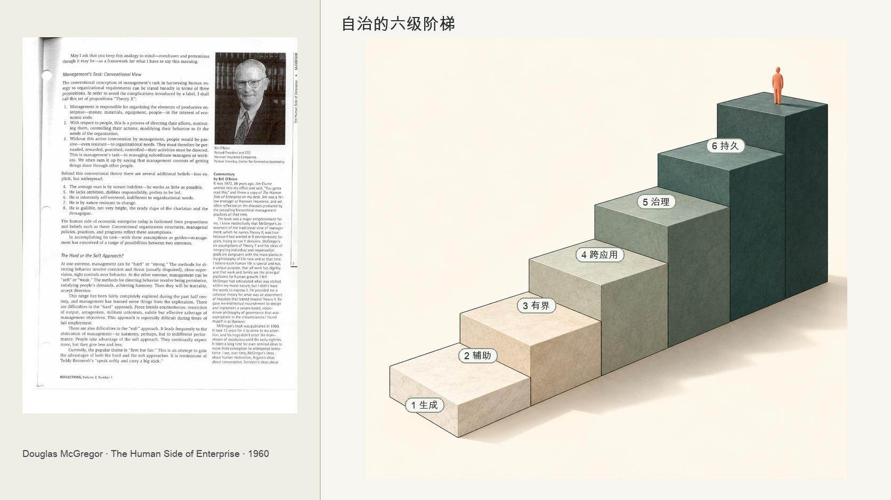
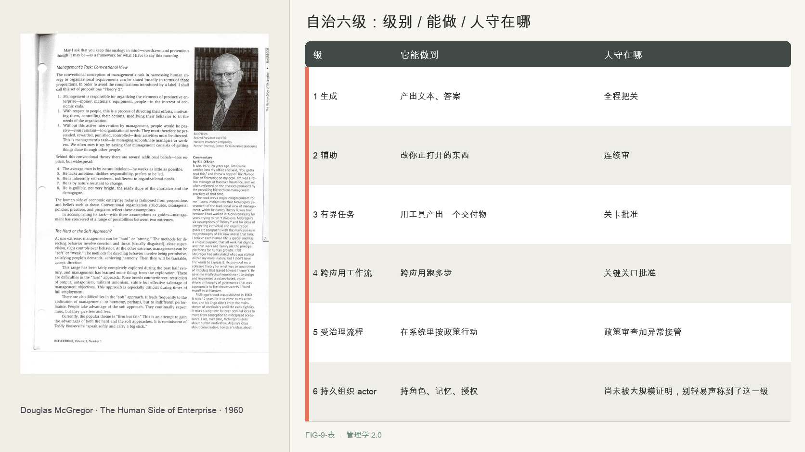

# 第 9 章　自治不是二元开关

你敢让一个 Agent 自己发邮件吗？

可以每封都人工确认，也可以完全自动发送。实际部署中，通常还有分级授权。

Meta 的个人 agent Muse 能替你订行程、买东西、发邮件，可它不是全自动的，背后有一个独立的东西叫 Sentinel，专门审查任何要触网的动作，该拦的拦、该问的问。xAI 的 Grok Bot，默认姿态是先起草、别发送，遇到发邮件、发布、购买、删除、改权限这些有后果的动作，它停下来等你点头。一些小团队操作者采用更谨慎的做法：先让 Agent 起草，由人发送；积累足够的真实案例并确认风险可控后，再考虑开放自动发送。

这些做法都不是全自动或全手动。Agent 可以从建议、起草逐步获得有限执行权；风险高的操作仍需批准。授权级别应依据它在具体任务上的验证记录，以及错误能否被发现和补救来决定。

因此，自治需要按任务和风险逐级调整，并能在出现问题时收回。

---

第 3 章讨论了麦格雷戈的 X/Y 理论。它也涉及管理者如何决定给员工多少自主权。

X 理论的管理者假设人不可信，于是收紧自主，严密监控、细碎审批、层层把关。Y 理论的管理者假设人可信，于是放开自主，给空间、给授权、给自我引导的余地。自主权给得过多，风险会上升；给得过少，又会限制员工发挥。管理者需要结合任务和能力作出判断。

麦格雷戈主张给予员工更多信任和自主空间。这个思路不能直接套在 Agent 身上：人能够理解规则、质疑不合理的任务；而 Agent 的权限通常需要按具体动作设定，不能只靠整体信任。

---

管理 Agent 仍然要回答自主权给到哪一步。权限太窄，Agent 只能处理琐碎任务；权限过大，错误可能造成更大后果。

但 agent 的自治，不能像对人那样一次性、粗粒度地给。因为 agent 的能力是不均匀的。它可能在起草邮件上极其可靠，在判断这封邮件该不该发上很不可靠。你没法像信任一个人那样整体信任它，只能针对具体的动作、具体的风险分别授权。Agent Harness 恰好提供了这种精细控制的手段，能精确到能读什么、能写什么、能调什么、能花多少、什么必须问人。

现有产品通过分级授权控制风险，例如先起草后放行、限制生产环境权限，或要求高影响操作经过批准。本书据此提出六级自治阶梯：生成、辅助、有界任务、跨应用工作流、受治理流程，以及持久组织 Actor。这个分类参考了学界的自治层级框架，但不与任何一套框架完全等同。第六级要求长期身份、权限和责任治理，目前尚未被大规模、可信地证明。

---

实践中，可以依据已验证的能力和错误后果的可逆性逐步放权；发生问题时，再降低授权级别。

授权时要看三个方面：

第一，逐步放开。从起草开始，达到验收要求后，再允许它处理低风险操作。

第二，依据证据而不是印象。可以先积累真实案例形成评测集，并在更换提示、工具或模型后重新评估。Isenberg 提到过约五十个案例的量级，但这只是评测起点，不是自动放权的安全阈值。

第三，权限可以降级。Agent 出错后，管理者可以暂时收回部分权限，再调查原因。

持久运行本身不足以构成“数字员工”。第六级还要求可撤销的独立身份、明确角色、受政策约束的权限、持续能力证据、记忆与学习治理、完整审计、明确的人类问责主体，以及退出和交接机制。

对人可以先给成长空间；对 Agent，应先验证具体能力，再按风险授权。

---

给任何一个 agent 授权前，先用两样东西给它定位。

第一，用七个问题划清它的边界，这是小团队操作者 Isenberg 的清单。什么唤醒它。它需要什么上下文。它能调用什么工具。它能自主做什么。发送或执行前，什么必须批准。什么情况升级给人。你怎么知道它成功了。

第二，把它放到六级阶梯上。

| 级 | 它能做到 | 人守在哪 |
|----|---------|---------|
| 1 生成 | 产出文本、答案 | 全程把关 |
| 2 辅助 | 改你正打开的东西 | 连续审 |
| 3 有界任务 | 用工具产出一个交付物 | 关卡批准 |
| 4 跨应用工作流 | 跨应用跑多步 | 关键关口批准 |
| 5 受治理流程 | 在系统里按政策行动 | 政策审查加异常接管 |
| 6 持久组织 actor | 持角色、记忆、授权 | 尚未被大规模证明，别轻易声称到了这一级 |

这两项记录能说明 Agent 当前的授权级别、边界，以及何时应升级或降级。

---

单个 Agent 的授权确定后，组织还需要管理身份、权限和审批关系。多个 Agent 并行运行时，这些规则如何保持一致？

如果权限分散、临时设置，组织就难以判断每个 Agent 能做什么、应向谁升级。下一章讨论韦伯的科层制，以及如何用稳定规则管理这些执行者。

## 本章插图

