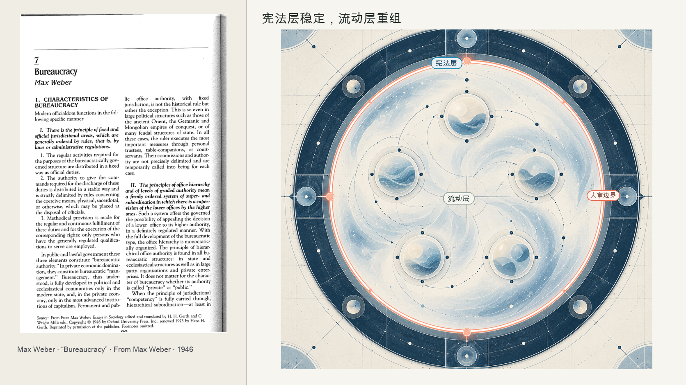
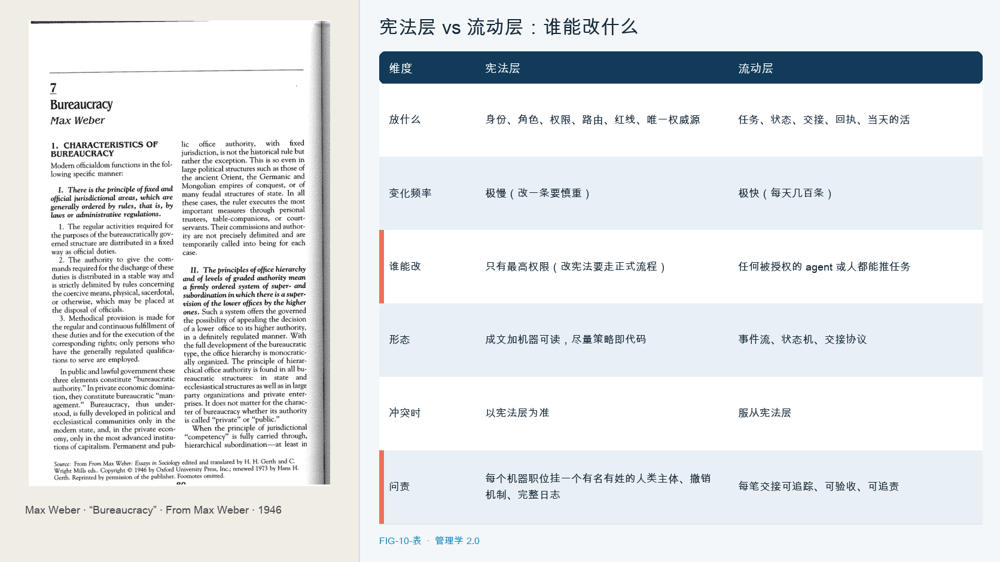

# 第 10 章　双层组织

先讲一个我自己的故事，一个亲手搭出来、也亲手搞砸过一次的系统。

过去一年，我给自己搭了一套由二十多个 AI Agent 组成的系统，分别用于看盘、写作、研究和硬件管理。很快，我发现规则和日常任务混在一起，Agent 会读到过期或互相矛盾的指令。

起初，我把身份、规则、路由、当天任务和临时交接都放在同一处。任务信息不断变化，稳定规则很快被淹没；修改规则也得从大量日常记录里找。Agent 还会读到过期或相互矛盾的指令。

后来，我把系统拆成两层。一层叫 00-Global，是宪法，放那些几乎不变的东西，每个 agent 是谁、有什么权限、路由规则、绝对不能碰的红线。它是唯一权威源，谁和它冲突以它为准。另一层叫 Harness-Exchange，是事件总线，放那些每天都在变的东西，谁派了什么任务给谁、干到哪一步了、交接的成品、验收的回执。它高频流动，但碰不到宪法。

拆分后，稳定规则留在宪法层，任务和交接在流动层更新。后来我发现，这种安排与韦伯对大型组织秩序的研究有相通之处，只是我管理的执行者中还包括 Agent。

---

韦伯研究的问题是，一个庞大的现代组织，国家、大企业，凭什么能可预测地运转，而不依赖某个人的私人关系、家族特权或个人魅力。

韦伯把这种权威称为理性法定权威，其典型组织形式是科层制。这里说的科层制，是韦伯分析的制度形式，不等同于日常所说的官僚主义。他指出，科层制之所以强大，靠的是一套非人格的机制，清晰的职位和管辖范围、按能力选人、职位与私人财产分离、层级分明、靠成文规则和书面记录办事。它的好处是组织的运转不依赖任何具体的人，张三走了，李四接上，职位还在、规则还在、记录还在，组织照常运转。用韦伯的话说，官僚制行政的优越性，首要来源在于技术知识的作用，它带来精确、快速、明确、连续、审慎、统一。

科层制也有代价。带来可预测性的规则可能压缩个人自由，让程序压过目的。因此，讨论它的组织功能时，也要看到僵化和形式主义的风险。

韦伯讨论的职位由人承担，人能够理解规则并承担责任。Agent 进入这些工作流程后，职位和责任的关系需要重新说明。

---

韦伯讨论的非人格规则、身份、层级和记录，仍能帮助组织管理 Agent；具体配置则需要扩展到软件的权限和运行记录。

企业级 Agent 需要明确身份、角色范围、可调用工具、数据权限、决策阈值、运行日志和问题升级路径。这些安排与韦伯讨论的职位、资格、文件和层级相对应。Agent 可以快速连续执行，因此事前权限控制和事后记录都很重要。

Agent 时代还增加了一种韦伯未曾面对的控制方式。传统制度依赖人阅读并遵守书面规则。Agent 系统可以把部分政策写成代码，由权限系统直接执行。这种“策略即代码”的方式，让规则具备机器可执行性。

我的系统采用了两层：00-Global 存放机器可读的身份和稳定规则；Harness-Exchange 记录任务、状态与交接。两者分开后，日常任务不再覆盖稳定规则。这个结构来自一次实际故障，也对应一个常见的设计需求：规则需要稳定，事件则需要频繁更新。

---

一个人机组织可以分为两层：稳定的宪法层和高频更新的流动层。

宪法层放那些几乎不变的东西，身份、角色、权限、路由、红线、唯一权威源。它变得慢、改得少、权威高，是整个组织的该信谁、谁说了算、什么绝对不许。流动层放那些每天都在变的东西，任务、状态、交接、回执，它高频流动、随时更新，但碰不到宪法层。

分层的原因在于两类信息变化速度不同。任务每天更新，身份和红线则应相对稳定。若它们混在一起，Agent 可能把临时指令当成长期规则，也可能读到过期信息。分开存放，能减少这种冲突。

权威可以由代码和权限系统执行，但问责仍要落到具体的人或机构。每个 Agent 职位都需要明确负责人、撤销机制和可追溯记录。

---

要把一个人机组织搭成双层，先分清什么进哪一层。

| | 宪法层（00-Global 式） | 流动层（Harness-Exchange 式） |
|--|------------------------|------------------------------|
| 放什么 | 身份、角色、权限、路由、红线、唯一权威源 | 任务、状态、交接、回执、当天的活 |
| 变化频率 | 极慢（改一条要慎重） | 极快（每天几百条） |
| 谁能改 | 只有最高权限（改宪法要走正式流程） | 任何被授权的 agent 或人都能推任务 |
| 形态 | 成文加机器可读，尽量策略即代码 | 事件流、状态机、交接协议 |
| 冲突时 | 以宪法层为准 | 服从宪法层 |
| 问责 | 每个机器职位挂一个有名有姓的人类主体、撤销机制、完整日志 | 每笔交接可追踪、可验收、可追责 |

判断信息该放在哪一层，可以看它是稳定规则还是持续变化的事件。放错位置，可能导致规则被日常变化冲淡，或让任务流程过于僵化。

---

双层组织把稳定规则和日常任务分开，但没有说明如何判断任务产出是否可靠。

一个 agent 一周产出一千个东西，每个都格式工整、逻辑自洽、图文并茂。可漂亮的外表，恰恰可能盖住里面的错误。三个办公 agent 拿到同一份销售数据，算出来的季度总额能差出一半还多，而每一份的 PPT 都做得无可挑剔。下一章讨论如何从 KPI 转向证据链，核验 Agent 产出的质量。

## 本章插图

