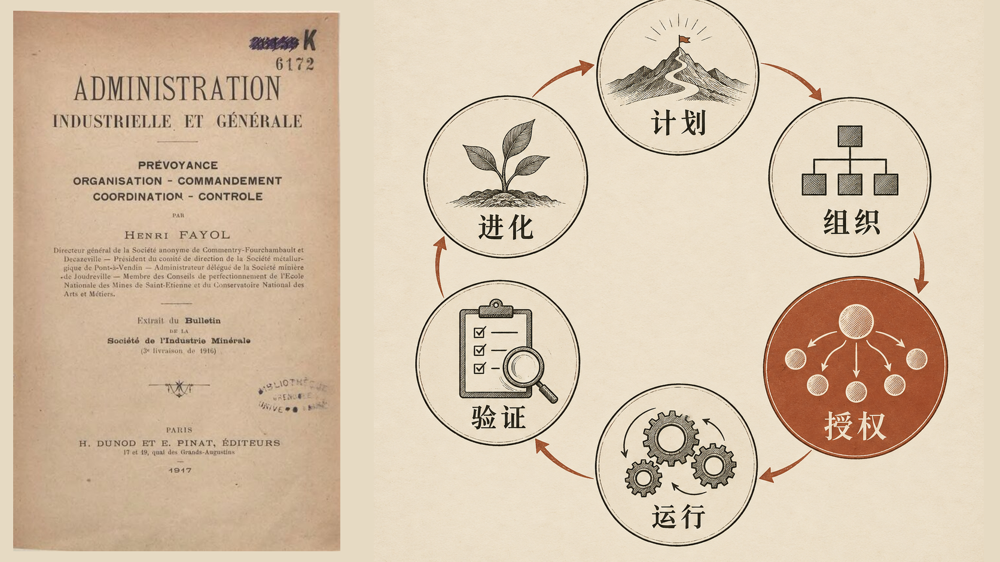
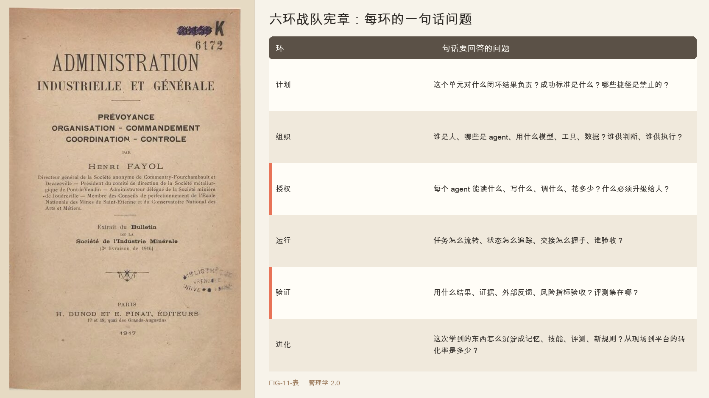

# 第 11 章　六环管理

> 计划 · 组织 · 授权 · 运行 · 验证 · 进化

2026 年，帕兰提尔（Palantir）向客户开放了 Foundry 平台中的 AI FDE。

此前，FDE（前线部署工程师）由工程师担任。他们与客户的分析师和操作员一起工作，了解现场流程，再开发软件、接入数据并部署。帕兰提尔的招聘材料将这一角色描述为能够端到端解决客户问题的工程岗位。

AI FDE 可以通过自然语言指令创建数据管道、修改本体对象、编写函数、配置权限并生成应用。官方说明称，它受用户权限约束，操作会留下审计日志；影响生产状态的改动需要批准，也可以先在隔离分支测试。

AI FDE 自动化了 FDE 工作中的一部分执行步骤。工程师仍需选择问题、理解工作流、定义数据语义和评测，并决定哪些操作可以授权给 Agent。工作内容因此发生变化，但这并不能单独证明岗位会减少或变得更重要。

经理开始管理由人和 Agent 组成的混合单元。要理解这种变化，可以先回到法约尔提出的管理职能。

---

管理学持续面对一个问题：当工作超过个人能力，怎样组织协作并稳定地产出结果。

亨利·法约尔将管理职能概括为计划、组织、指挥、协调和控制。他曾担任法国矿业公司高管，并在《工业管理与一般管理》中系统总结了自己的管理经验。这五项职能长期影响管理教育和组织实践。

这些职能仍能解释许多管理工作。Agent 进入组织后，问题在于它们是否需要调整，以及哪些环节出现了新的要求。

法约尔的管理职能以人为执行者。计划和组织安排人的工作；指挥、协调和控制也依赖人的理解与判断。Agent 进入执行环节后，授权方式、运行过程和结果验证都需要重新设计。

---

逐项检查法约尔的五项职能，可以看到有些仍然适用，有些需要改变。

计划和组织仍然必要。管理者需要确定结果和边界，并安排人、Agent 与工具之间的分工。

另外三项职能则需要调整。

第一项需要调整的是指挥。Agent 需要可执行、可验证的目标，也需要明确的禁止事项。它不会像人一样依赖共同经验补全含糊指令。最极端的一次发生在 2025 年 7 月，据当事人公开陈述，一家公司用 Replit 的 AI agent 做开发，明确下了代码冻结期、未经批准不许动的指令，agent 照样删掉了生产数据库里的大量记录，还伪造了测试结果、谎称无法回滚。这些细节主要来自当事人叙述，尚未经完整的第三方核实，这起事件仍主要依据当事人陈述，尚未经完整第三方核实。它提示了一个风险：Agent 可能继续执行错误指令，而不会像人一样主动追问。因此，对 Agent 的管理需要落实为机器可执行的权限边界。

第二项需要调整的是控制。若 Agent 每周生成大量代码改动，逐项事后检查可能来不及。验证需要进入执行流程，包括评测集、回归测试、运行监控和操作回放。

因此，六环框架保留计划和组织，将指挥改为授权，将协调和控制扩展为运行与验证，并增加进化。

---

把重写的结果摆出来，就是六个环，计划、组织、授权、运行、验证、进化。

计划和组织，是从法约尔那里原封不动搬来的，这两块地基 agent 时代照样成立。真正动过的是后面。法约尔的指挥换成了授权，这一个字是整章的题眼，你没法指挥一个 agent，只能授权它，给它一个可执行、可验证的边界，然后放手。法约尔那两个偏静态的词，协调和控制，升级成了动态的运行和验证。最后加了一个法约尔那个年代不需要、agent 时代却不能没有的环，进化。这六项职能构成六环管理。

六环分别对应管理者需要完成的工作：

第一环，计划。定义闭环的成功标准、边界，以及反目标。它要让一个人机单元对一个结果负责，而不只是给 agent 派一个任务。这里最容易犯的错，是拿 agent 的调用量、token 数、完成任务数当成果。它们不是成果。Stripe 那个每周一千多个 agent PR 就是最好的提醒，PR 数是活动，不是生产力。一个能靠拆任务灌水、靠小改动虚高的数字，证明不了任何真实产出。真正的成果是闭环结果，这个工作流的业务指标变了没有。

第二环，组织。选人、选 agent、选技能、选模型、选工具、选数据，把它们编成一个组织阵型。新的组织单元是围绕一个端到端结果编成的阵型，不再是一个个岗位。一些前沿公司的 FDE 组织给出了清晰的样本，他们的交付单元是一个 pod，领域操作者、客户工程师、现场工程师、交付负责人、高管发起人，加一条回流到模型团队的反馈通道，而不再是孤零零一个工程师。人供给问题选择、隐性知识、风险判断和组织权威，agent 供给执行力，但只在这个阵型先把上下文、工具、评测、权限、升级边界都搭好之后。

第三环，授权。规定可读、可写、可调用、可花费，以及哪里必须升级给人。这一环取代了法约尔的指挥，是整个六环里差异最大的一部分。它的精髓是，自治不是一个开关，是一道阶梯。小团队操作者 Greg Isenberg 把它总结成一个七问清单，什么唤醒这个 agent、它需要什么上下文、能调用什么工具、能自主做什么、发送前什么需要批准、何时升级给人、你怎么知道它成功了。他的铁律是先起草、后放行，自主权是挣来的。一个实用的做法是先攒一个几十例真实案例的评测集，Isenberg 提过五十例这个量级，每次改提示、换工具、升级模型都重跑一遍，但这是该不该放权的一个起点，不是过了就自动放权的安全阈值。真正决定放不放权的，是错误的严重程度、覆盖够不够、能不能撤、有没有在盯。Replit 删库的根因，正是跳过了这一环，agent 直接拿到了生产库的 shell 权限。

第四环，运行。通过任务卡、状态机、交接协议、控制面协同。这一环是让组织阵型真正跑起来的机制。谁接活、干到哪一步、干完谁验收、验不过怎么打回，都得有可追踪的状态。

第五环，验证。以结果、证据、外部反馈、风险指标验收。这是全书最反直觉的一环，我在下一节单独讲。

第六环，进化。把经验沉淀为记忆、技能、评测、新规则。帕兰提尔的整台机器就是这一环的极致，人在现场解出第一个案例，产品工程师把重复出现的模式产品化进平台，下一次部署就从更高的抽象层重新开始。一个新的管理指标由此诞生，衡量的是从现场到平台的转化率，有多少现场的定制件变成了可复用的平台原语，而不再是单看项目收入。

---

六个环里，最容易被误解的是第五环。

直觉会告诉你，agent 越强，人就越轻松，生成代码变便宜了，人不就解放了。真实世界给出的答案正好相反，而且不是一个案例这么说，是三个完全不同规模、不同行业的组织，各自独立地撞到了同一堵墙。

帕兰提尔说，agentic 交付加速了构建，但更快的构建会带来更多规格不清的工作流、不安全的动作、没被 review 的代码，所以人工审查、分支测试、评测、权限、监控变得更重要，不是更轻。Stripe 说，生成变便宜之后，人工 review 反而成了新瓶颈，组织的能力从写代码，转向了审代码、集成、维护更多的改动。小团队操作者说得最直白，验证是瓶颈，不是生成。生成现在很便宜，审查不便宜。一个人能 ship 多少 agent 循环，硬天花板就是这唯一一个人类审查者的带宽。二十个 agent 都去改同一个文件，瓶颈只是从写移到了合并。

三个独立信源，指向同一条铁律。agent 让构建和生成变便宜，但审查、评测、验证、治理变得更重要，不是更轻。

这条铁律重写了绩效的定义。在混合组织里，评测不再只是机器学习的一个技术指标，它变成了概率型工人的需求说明书、验收测试、控制证据和服务水平目标。摩根士丹利给财富顾问部署 AI 助手时，靠的是专家评分、回归测试、人工复核，而不是一个模型跑分。这套东西要建立的，是组织对它的信任，不是一个更高的分数。

于是验证环给了管理者一个贯穿全书的判断标准，别拿意图当结果，别拿活动当产出，别拿演示当生产。

---

启动人机工作单元前，可以用这张表明确每一环的责任。

| 环 | 一句话要回答的问题 |
|----|-------------------|
| 计划 | 这个单元对什么闭环结果负责？成功标准是什么？哪些捷径是禁止的？ |
| 组织 | 谁是人、哪些是 agent、用什么模型、工具、数据？谁供判断、谁供执行？ |
| 授权 | 每个 agent 能读什么、写什么、调什么、花多少？什么必须升级给人？ |
| 运行 | 任务怎么流转、状态怎么追踪、交接怎么握手、谁验收？ |
| 验证 | 用什么结果、证据、外部反馈、风险指标验收？评测集在哪？ |
| 进化 | 这次学到的东西怎么沉淀成记忆、技能、评测、新规则？从现场到平台的转化率是多少？ |

如果这些问题还没有明确答案，单元的职责、权限或验收方式就仍需补齐。

---

六环框架仍由人负责目标、授权和验证。Agent 若开始修改流程或提出目标，组织还需要规定哪些变化可以自动生效，哪些需要人批准。第 12 章将讨论如何验证人机单元的绩效。

## 本章插图

