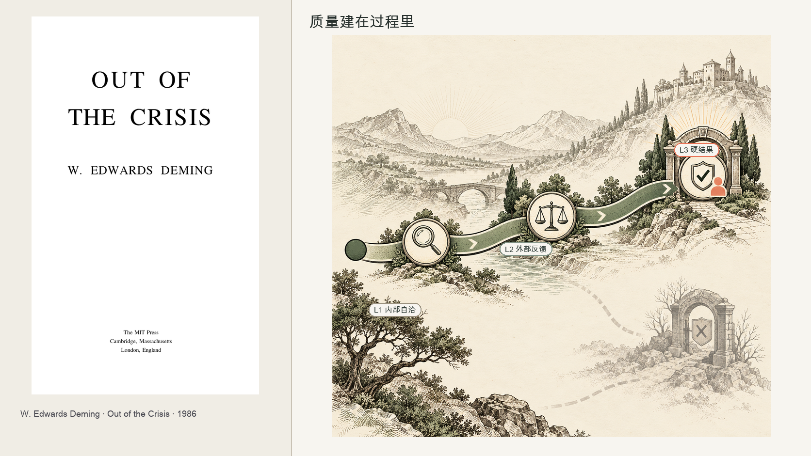
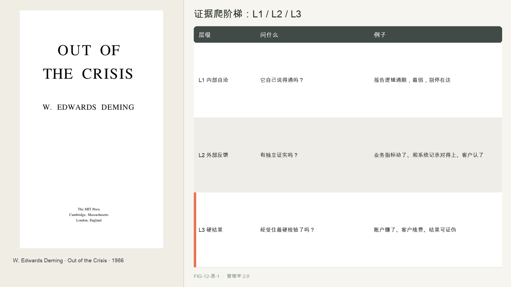
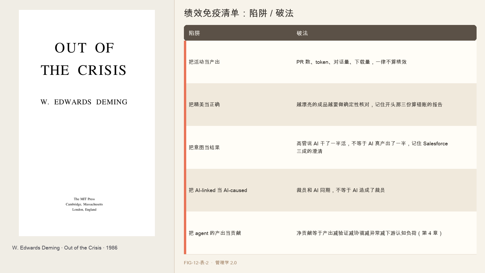

# 第 12 章　从 KPI 到证据链

2026 年，一次测试把同一份销售数据和同一套指令交给三个办公 Agent：腾讯 WorkBuddy、千问 Office 和豆包 Work，让它们分别生成季度分析。

三份报告都有完整的 Word、Excel 和 PPT，格式也很专业。但它们算出的季度总额彼此相差很大，足以改变分析结论。相同输入得到了不同数字，精致的版式没有暴露计算错误。

这类结果暴露了绩效评估中的一个风险：成品的完整度与计算的正确性并不相同。版式精致、内容自洽，仍不能替代与原始数据的核对。Agent 生成精美报告的成本很低，因此错误可能被包装得更完整。

当产出变得容易生成，绩效评估就需要更可靠的证据。戴明关于质量管理的观点可以提供一个起点。

---

第 8 章讨论了戴明的持续改进思想。本章关注他的另一项主张：不要把质量寄托在末端检验上。

战后，戴明的质量管理思想影响了日本制造业。他反对只在产品完成后挑出次品，主张从流程设计开始控制质量。他的观点可以概括为：不要依赖检验获得质量，而要从一开始就把质量做进产品。

戴明认为，质量问题往往来自流程，而不只是个人失误。末端挑出次品，不能替代对生产过程的改进。他也主张区分系统性波动和偶发问题，并反对用数字指标和惩罚来驱动产量，因为这可能导致员工牺牲质量或隐瞒问题。

戴明讨论的是人的生产线和物理产品。Agent 的运行速度更快，产出也可能是概率性的内容或决策，因此验证方式需要相应调整。

---

戴明强调的过程质量控制，也适用于 Agent 工作流。

Agent 可能每周生成大量结果，逐项依赖人工末端检验难以覆盖。质量检查需要前移到训练数据、提示词、工具接口、评测集和部署流程。只在流程末端增加审查者，不能替代对系统本身的治理。

但 agent 给绩效带来了一个戴明没见过的新麻烦。agent 的产出是概率性的、依赖上下文的，而且它还能改变被测量的那个过程本身。更麻烦的是，你想用另一个 AI 去检验它，可那个检验的 AI，很可能和被检验的 AI 有着同样的盲点。

PR 数、token、对话量和完成任务数都容易计数，却不能单独说明业务贡献。Stripe 每周生成的上千个 PR、Klarna 用“700 名客服工作量”描述的对话量，都需要结合质量和实际结果解释。开头的测试也说明，即使交付了一份完整报告，数字仍可能出错。

因此，Agent 的绩效评估需要分层验证，不能只依赖一个指标或末端审查。

---

绩效评估不能只看 KPI 数字，还要追问产出是否真实、正确并形成贡献。本书把核验证据分成三个层级，称为验证阶梯。

L1 内部自洽，它自己说得通吗。这是最弱的一层，精美的报告都能自洽，开头那三份算错账的报告都自洽。L2 外部反馈，有没有外部的、独立的东西证实它，业务指标真的动了、客户真的认了、和系统记录对得上。L3 市场或可证伪结果，它经受住了最硬的检验吗，账户真的赚了、客户真的续费了、结果可被证伪。

越往上，证据越硬。agent 的绩效不能停在 L1，得爬到 L2、L3。开头那个算错账的翻车，就死在只看 L1，三份报告都自洽，可谁都没做 L2 那一步，拿它算的数字，去和原始数据、和系统记录，做一次确定性的核对。

将证据链嵌入流程，确定性数值应自动核对，结果应与系统记录比对；还应安排独立交叉检查。高后果操作由人审查，可逆操作则可根据风险决定是否先行执行。

---

评估 Agent 单元时，可以先检查证据层级，再核对常见误区。

第一，证据爬阶梯。

| 层级 | 问什么 | 例子 |
|------|--------|------|
| L1 内部自洽 | 它自己说得通吗？ | 报告逻辑通顺，最弱，别停在这 |
| L2 外部反馈 | 有独立证实吗？ | 业务指标动了、和系统记录对得上、客户认了 |
| L3 硬结果 | 经受住最硬检验了吗？ | 账户赚了、客户续费、结果可证伪 |

第二，核对以下常见误区：

| 陷阱 | 破法 |
|------|------|
| 把活动当产出 | PR 数、token、对话量、下载量，一律不算绩效 |
| 把精美当正确 | 越漂亮的成品越要做确定性核对，记住开头那三份算错账的报告 |
| 把意图当结果 | 高管说 AI 干了一半活，不等于 AI 真产出了一半，记住 Salesforce 三成的澄清 |
| 把 AI-linked 当 AI-caused | 裁员和 AI 同期，不等于 AI 造成了裁员 |
| 把 agent 的产出当贡献 | 净贡献等于产出减验证减协调减异常减下游认知负荷（第 4 章） |

这套方法把绩效评估从单一数字转向可追溯、可证伪的证据。若产出缺少 L2 或 L3 证据，就不应只因数量多或外观完整而扩大使用。

---

证据链主要评估单次产出。Agent 还可能根据经验修改提示、方法或技能。组织需要进一步区分：哪些执行方法可以自动调整，哪些目标和规则必须经过人批准。下一章讨论 Agent 学习的权限边界。

## 本章插图

