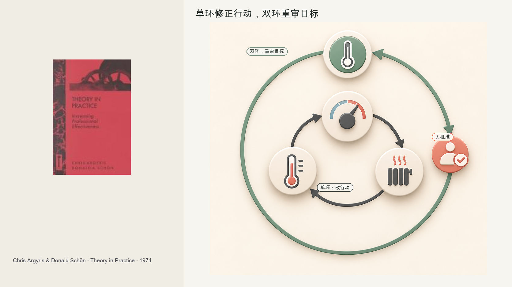
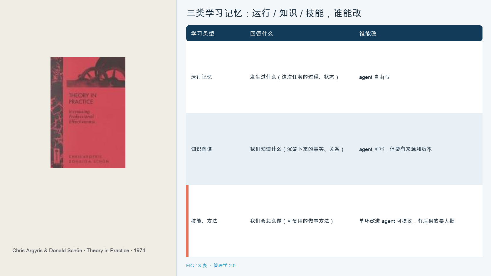

# 第 13 章　学习系统

有家小公司做了个东西叫 AI 科学家。它想干一件很大的事，让 AI 自己做研究，自己想课题、查文献、写代码、跑实验、画图、写论文，甚至自己做同行评审。

据报道，这个 AI 科学家投出去的几篇论文里，有一篇通过了一个研讨会的评审。听起来很惊人。但同一批报道也老实记下了它的毛病，想法平庸、实现出错、引用是编的、科学严谨性时好时坏。独立的评估还发现，它跑的实验会失败，它判断新颖性的能力很弱，而且它没法批判自己的结论。

这个 AI 科学家确实在学习：它会重试、改代码、优化方法，直到达成给定目标。但它还不会追问课题是否值得做、目标是否正确。它能把一件事做得更好，却分不清这件事该不该做；能修正行动，不能反思目标。

这一区别关系到 agent 学习系统的安全边界。六十年前，研究组织学习的学者克里斯·阿吉里斯已经提出了有用的区分。

---

克里斯·阿吉里斯研究了一个奇怪的现象，很多组织明明发现了错误，却一次次重犯。它们会修正具体的操作，却死活不肯碰那个导致错误的规则、政策、假设。更妙的是，聪明人和信息系统还会把这种不肯碰包装得很好，让根本的矛盾更难被讨论。

他用一个比喻讲清了这件事，比喻的主角是恒温器。一个恒温器设定二十度，低了就加热、高了就停，它一直在学习，根据温度调整行为。阿吉里斯说这叫单环学习，在不改变目标，也就是二十度这个设定的前提下，修正行动。但如果有人问，二十度这个设定本身对吗，该不该是二十二度，该不该白天一个温度、晚上一个温度，质疑那个设定本身，这叫双环学习。

阿吉里斯把组织学习定义为发现并修正错误。单环学习改变行动，但保留支配行动的目标和价值；双环学习，则连那个支配性的目标和价值本身，一起检查和改变。用恒温器说，单环学习是按设定调温度，双环学习是重新设定那个设定。一个组织如果只会单环学习，它能把错事越做越熟练，却永远走不出那个错误的方向。

但阿吉里斯谈的双环学习，主体是人，是人在反思、在质疑、在重新设定目标。他从没想过，有一天那个恒温器自己会想去改自己的设定。现在，agent 就想干这事。

---

单环和双环的区分，也能用来理解 agent 的学习。

agent 极其擅长单环学习，它会重试、会重新规划、会换个工具、会把提示词优化到达标为止，给它一个目标，它能不知疲倦地逼近它。这正是阿吉里斯说的单环，在不改变目标的前提下修正行动。而且 agent 还能帮人做双环学习，它能跨大量案例，把散落的政策、证据、结果、异常摆到一起，帮人看清我们那个假设是不是从一开始就错了。阿吉里斯的框架照样锋利。

但 agent 带来了一个阿吉里斯没有讨论过的问题：恒温器开始尝试修改自己的设定。新一代的 agent 不只会执行，还会积累，它有记忆、能沉淀经验、能自己创建和改进技能。第 8 章谈过，agent 会把方法沉淀成 Skill。学习则让这份方法进入循环：拿去使用，积累新经验，再据此修订。前面讲过的两条 agent 血统里，Hermes 那一支的核心卖点，正是这么一个越用越懂你的闭环，它把成功的经验变成自己以后会用的程序性记忆。如果方法长期不修订，就会逐渐过时。新一代 agent 开始尝试接手这项修订工作。

它开始碰那个支配行动的东西了。开头那个 AI 科学家就是活样本，它单环学习很强，把实验一遍遍跑好，但一旦涉及双环，这个课题该不该做、这个结论对不对，它就露馅，它没法批判自己的目标。风险也在这里：agent 可以尝试改变目标，却还不具备判断目标是否值得改变的能力。让它独自决定下一步该做什么，组织就把未经验证的判断权交了出去。

因此，单环与双环的区别在 agent 时代也是权限边界。

---

权限可以按学习类型划分：单环学习可由 agent 自行完成；涉及双环学习时，agent 提出建议，由人批准。

单环，改行动、改提示、换方法、重试，可以放手让 agent 自己干，这是它的强项，也没什么危险。双环，改目标、改约束、改政策、改它自己用的技能和奖励，agent 只能提议，必须由被授权的人批准，而且要留下可追溯的记录、可以回滚。

这种权限不对称有实际原因：目标、约束、政策和奖励函数属于组织的基本规则，不是普通运行参数。重试任务是在既定规则下调整行动；改写目标则是在改规则。前者是执行，后者关乎组织该做什么。

这条线正好接上第 10 章那个双层组织，双环学习碰的，恰恰是宪法层的东西。所以 agent 的单环学习可以在流动层里自由跑，但任何想改动宪法层的提议，都必须走一道人类批准的门。这也和第 9 章的渐进式自治一脉相承，放权可以逐格给，但改自己目标这一格，是最高的一格，甚至可能永远不该完全放开。

---

管一个会学习的 agent，先分清它在学哪一类东西，再给最危险的那类装上批准门。

先分三类学习，对应三种记忆。

| 学习类型 | 回答什么 | 谁能改 |
|---------|---------|--------|
| 运行记忆 | 发生过什么（这次任务的过程、状态） | agent 自由写 |
| 知识图谱 | 我们知道什么（沉淀下来的事实、关系） | agent 可写，但要有来源和版本 |
| 技能、方法 | 我们会怎么做（可复用的做事方法） | 单环改进 agent 可提议，有后果的要人批 |

再给双环装门。任何触及目标、约束、政策、奖励的改动，agent 只能提议，不能自己改；提议要在沙箱或影子环境里先测；按风险分级决定谁来批；批准后版本化，保留来源，可回滚；每一次宪法级改动，挂一个有名有姓的人类主体。

这套做法把学习分成两类：执行层面的调整可以逐步放开；触及目标和规则的修改必须经过批准。边界划得太窄，agent 连提示和方法都无法改进；划得太宽，它就可能自行改变组织要求它做的事。

---

学习系统规定了 agent 可以学到哪一步：日常行动可以调整，目标和规则的修改由人批准。

但这里藏着一个更冷的问题。当一个 agent 在它的权限内、按它的目标，认认真真干了一件事，结果这件事错了、造成了损失，谁负责。那个批准它目标的人，写它规则的人，运营它的平台，还是它自己。一个 agent 可以行动，可它能承担责任吗。一个能删库、能发错邮件、能给客户错误承诺的 agent，当它闯了祸，最后在那张单子上签字的，到底是谁。下一章，撞这本书最沉的一个问题，最后签字的人是谁。

## 本章插图

