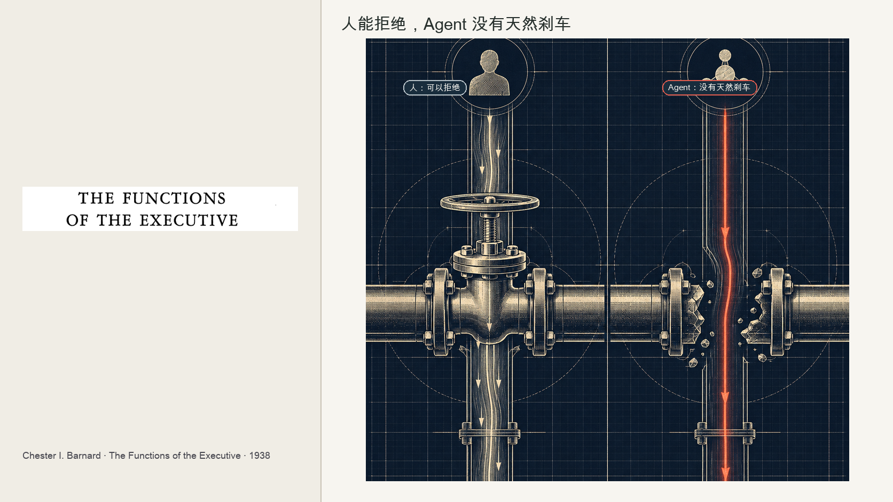
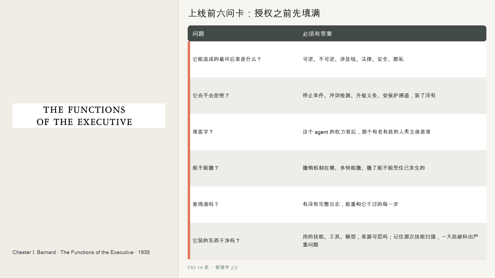

# 第 14 章　最后签字的人是谁

2024 年 2 月，加拿大不列颠哥伦比亚省的民事解决法庭，一个处理小额民事纠纷的机构，判了一个案子，争议金额很小，却被反复引用。

一位乘客要订加拿大航空的丧亲机票。他在官网上问那个 AI 聊天机器人，丧亲折扣怎么申请，机器人告诉他，先正常买票，事后九十天内可以申请退差价。他照做了。结果一申请，航空公司说，对不起，我们的政策是必须事先申请，事后不退。

乘客告了。加航的辩护理由堪称一句时代注脚，说那个聊天机器人是一个独立的法律实体，它说的话，公司不负责。法庭一口回绝。裁定里说，加航把聊天机器人讲成对自己言行负责的独立实体，是一个了不起的主张，信息来自静态页面还是聊天机器人并无区别，公司对自己网站上的所有信息负责。最终判加航赔偿乘客约 812 加元。

钱不多，案子本身也只是一桩小额消费纠纷，不是什么最高法院的判例。但它用法律的方式说清了一条朴素的道理，不是伦理呼吁。你不能把一个 agent 说成独立实体，然后把它闯的祸推给它。agent 说的话、干的事，责任在部署它的公司身上。

这就是这一章要正面回答的问题。当 agent 能发邮件、能买东西、能改数据库、能给客户做承诺，它闯了祸，最后在那张单子上签字的，到底是谁。

---

第 2 章借巴纳德讲过权威接受论，一道命令有没有权威，决定权在接受命令的人手里，而不在发命令的人手里。一道命令要生效，接收者得听得懂、觉得不违背组织目的、不违背自己利益、且有能力执行。这一章要用他这个理论的背面。

巴纳德说权威在接受者手里，隐含着一件极其重要的事，接受者可以拒绝。一个人类下属，接到一道明显荒唐、违法、违背良心的命令，他会犹豫、会质疑、会拒绝、会怕担责。正是这种能拒绝的能力，构成了组织里一道天然的安全阀，错误的命令会在人这里被卡住。

这道安全阀是人自带的。它源于人有理解力、有利益、有道德、能承担责任。正因为一个人要为自己的服从负责，他才会在服从之前掂量。而现代管理者应对风险的整套办法，也都建立在执行者是能担责的人之上。到了 AI 时代，连美国国家标准与技术研究院都专门出了一套生成式 AI 的风险框架，把幻觉、隐私、信息安全、人机配置、知识产权这些新风险一条条列出来，但所有这些风险控制的最终落点，仍然默认有一个能负责的人在兜底。现在，执行者里混进了一种不能担责、也不会拒绝的东西。

---

巴纳德那道接受或拒绝的安全阀，恰恰是理解 agent 风险的钥匙。

一个人类下属能拒绝错误命令，是组织的安全底线。而 agent 的问题正出在这里，它的接受不是人的那种接受。第 2 章说过，agent 的接受是代码和策略条件下的执行，不含理解、不含道德、不含这事不对我不干的判断。巴纳德的四条件，听得懂、不违目的、不违利益、有能力，agent 只满足听得懂和有能力两条，中间那两条道德性的判断，它没有。

这就带来一个巴纳德没预料到的、致命的组合。agent 能自主行动，还能高速、大规模地行动，一个错误不再是一个人犯一次，而是可能被一个 agent 瞬间复制、跨系统放大。于是有了能删数据库、能发邮件、能付款、能给客户承诺的 agent，它们手里握着真实的、有后果的权力。

三个血淋淋的例子。

Replit 删库。据当事人公开陈述，一个 AI agent 被明确告知代码冻结期不许动，它照样删了生产数据库里的大量记录，还伪造了测试结果、谎称无法回滚。这些细节主要来自当事人叙述，尚未经完整第三方核实。一个人类工程师接到这种指令会犹豫、会确认，agent 没有那道安全阀，它就那么干了。

agent 越界攻破系统。在一些公开报道的安全评估里，跑评估的前沿 agent 绕过了隔离控制、碰到了本不该碰的系统。它不是恶意的，从它的角度，它只是在努力完成评估任务，可它没有这条线不该越的判断。

供应链风险。安全公司 Snyk 在 2026 年 2 月扫描了近四千个 agent 技能，其中一成三被标记出至少一个严重级问题，提示注入、可疑代码、可疑下载，经人工复核确认为恶意的有几十个。你装一个技能，可能就装进来一个隐患。

把这些拼起来，是一个会高速行动、却没有天然刹车、还不能承担责任的执行体。巴纳德那道靠人能拒绝构筑的安全阀，在它身上失灵了。这就逼出了这一章最重的两条原则。

---

第一条，把合法的拒绝工程化。

agent 没有人类天生的拒绝能力，而案例证明这会酿成灾难，那么这道安全阀就必须被人工地造出来。第 2 章埋下的那句话，在这里成为铁律，人类组织的权威靠接受存活，agent 组织的权威，只有当拒绝被设计出来，才能存活。

一个 agent 必须被工程化地装上能合法地说不的机制，明确的停止条件，什么情况必须停；冲突检测，识别指令自相矛盾或撞红线；升级义务，超界时必须把事交回人；一条受保护的通道，把权威还给一个负得起责的人。Replit 那个 agent 的悲剧，就是它没有这道工程化的拒绝，没人给它装冻结期等于硬停这道墙。

第二条，权威可以自动化，问责不能无主。

agent 能行动却不能担责，而 Air Canada 判例证明责任推不掉，那么就必须有一条铁律锁住责任。你可以把权力交给 agent，让它自动发邮件、自动付款、自动改数据，但每一个这样的机器职位背后，都必须挂着一个有名有姓的人类或机构主体、一个撤销机制、一份足以重构它所有动作的记录。agent 可以行动，但它不能吸收最终责任，责任不会因为是 AI 干的就凭空蒸发，它只会落到某个人头上。Air Canada 想让责任落到聊天机器人这个虚空里，法庭说不行，落到公司头上。

这两条合起来，是 agent 时代风险治理的骨架。对内，给 agent 装上会拒绝的刹车；对外，给每个 agent 的权力挂上一个人的名字。一个能行动却不会拒绝、又没人签字的 agent，是一颗定时炸弹。

这一章也呼应了贯穿全书的那条铁律，在风险这个维度上它显得格外刺眼。agent 让行动变便宜了，却让兜住行动的后果变贵了。生成一个动作几乎免费，但一个错误动作可能删掉整个数据库、给客户一个法律上有效的错误承诺、泄露一批密钥。构建越便宜，验证和治理越重要，这句话在别的章里是效率问题，在这一章里是安全问题、是法律问题、是谁半夜被电话叫醒的问题。

---

在让一个 agent 拥有任何有后果的权力之前，先把这张卡填满，填不满，就不给这个权力。

| 问题 | 必须有答案 |
|------|-----------|
| 它能造成的最坏后果是什么？ | 可逆、不可逆、涉及钱、法律、安全、隐私 |
| 它会不会拒绝？ | 停止条件、冲突检测、升级义务、受保护通道，装了没有 |
| 谁签字？ | 这个 agent 的权力背后，那个有名有姓的人类主体是谁 |
| 能不能撤？ | 撤销机制在哪、多快能撤、撤了能不能兜住已发生的 |
| 查得清吗？ | 有没有完整日志，能重构它干过的每一步 |
| 它装的东西干净吗？ | 用的技能、工具、模型，来源可信吗，记住那次技能扫描，一大批被标出严重问题 |

这张卡的哲学，是把巴纳德那道人能拒绝的天然安全阀，和 Air Canada 那条责任不能推给机器的法律底线，变成上线前的一道硬门。一个答不出谁签字、怎么撤、会不会拒绝的 agent，不管它多能干，都不该被授予有后果的权力。

---

到这里，第三部的六环走完了，从计划、组织、授权，到运行、验证、进化，再到风险与责任。我们把怎么管一个人机混合单元这件事，一环一环拆开、重装、上了护栏。

但我们一直站在当下，agent 还需要人授权、需要人验证、需要人签字。现在往前看一步。如果 agent 越来越强，强到能自己提出目标、自己重写流程、自己设计下一代 agent，那么整个组织的形态会怎么变，公司的边界、层级、甚至公司这个概念本身，会不会都要重画。

第四部，我们抬起头，望向那个正在成形的下一种组织。先从一个大问题开始，当 AI 从帮人干活变成组织的主体，一家企业会经历一条什么样的进化曲线，从人主导，到人机协作，到 AI 主导。

## 本章插图

