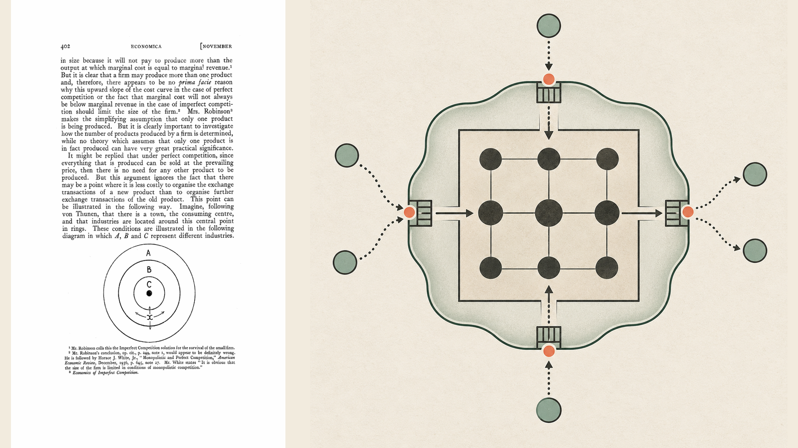
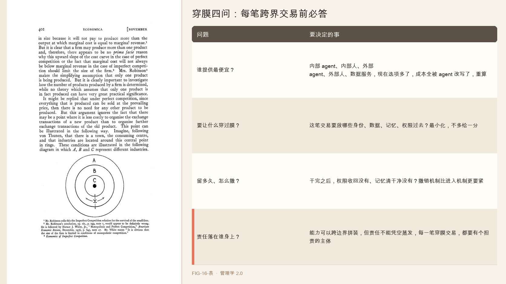

# 第 16 章　企业边界重画

2024 年，一家叫 SSI，安全超级智能的公司融了十亿美元。它当时有多少人，十个。后来它又融了一轮更大的，但十个人、十亿美元这张 2024 年的快照，已经足够说明问题。

这不是个例。米拉·穆拉蒂的 Thinking Machines，一轮就融了约二十亿美元、估值约一百二十亿，融资和估值是两回事，别混。伊利亚·苏茨克维尔的 SSI，一句直奔安全超级智能的使命，一份创始人声望，就能调动十亿美元级的资本，和芯片厂商约定巨量的算力供给。

十个人，十亿美元。这个资本对人头的比例，在整个商业史上都没出现过。它意味着一件事，一个小到极致的研究内核，第一次可以不必先变成一家大公司，就能指挥工业级的资本、算力和分发。

但更值得看的是它怎么做到的。SSI 自己不造芯片、不建数据中心、不铺分发网络，这些全都在别的公司手里，靠一纸合同接过来。研究的方向它自己攥着，工业的地基它一样都不拥有。一家独立的公司，核心是十个人，它身后，是芯片厂、云厂、金融方、分发商组成的一整套庞大机器。表面的小，是一种精心设计的错觉。

这幅图景，九十年前有个人就画出了它的来路。他问的问题是，公司这个东西，凭什么存在。

---

1937 年，一个二十多岁的年轻人罗纳德·科斯问了一个当时没人觉得是问题的问题。如果市场这只看不见的手能高效配置一切资源，那公司为什么还要存在。为什么不是每个人都作为独立个体，在市场上一笔一笔地交易，而是要挤进一个叫公司的东西里，听从老板的指挥。

科斯的答案，后来让他拿了诺贝尔奖，简单到近乎粗暴，因为用市场是有成本的。你想在市场上买一项服务，得先找到谁能提供，这是搜索成本，谈好价钱和条件，这是谈判成本，盯着对方别偷懒，这是监督成本。这些成本，他叫它交易成本，有时候高到不如干脆把这件事搬进公司内部，用老板的一句命令代替一连串市场交易。

科斯给了一个至今无人推翻的判据，公司会一直扩张，直到在公司内部多组织一笔交易的成本，等于把这笔交易丢到市场上去做的成本为止。一句话，公司的边界，画在自己干和外面买哪个更便宜的那条线上。内部协调更便宜，就内化，市场更便宜，就外包。这条边界不是天生的，是算出来的，而且随时可以重画。科斯还补了一句诚实话，公司内部也不是没成本，管得越大，老板越顾不过来，错误越多，这就是公司规模的天花板。

科斯这套逻辑，管了近一个世纪的公司该多大、什么自己做什么外包。但他那个年代，搜索、谈判、监督这些交易成本，是实打实的、降不下去的。找一个供应商要托人、要打听，谈一份合同要来回扯皮，盯一个外包要派人。正因为这些成本高，公司才得长那么大，把很多事揽进来自己干。现在，有个东西正在把这些成本，一路压到趋近于零。

---

科斯那个市场还是层级的问题，在 agent 时代非但没过时，反而成了每天都要重算的活账。

agent 大幅压低了搜索、起草、协调、监督、切换的成本，在公司内部和跨公司之间，都压低了。它能让你更容易找到并对接外部专家，市场那边的成本降了，也能让你更容易编排内部的知识和流程，层级这边的成本也降了。科斯的问题原封不动还在，这件事，自己干还是外面买，只是等式里的每一项，都被 agent 改写了。

但 agent 带来的，不只是把老等式的数字改小。它引入了科斯没见过的第三种协调形态。Agent Harness 那套控制面、工作区、技能、权限成熟了，它的意义不只是让单个 agent 能干活，而是让能力可以被临时地、跨边界地编排，一个 agent 能带着受限的身份、受限的数据权，去调用另一个组织的服务，干完就撤。

于是有了 New Lab 这种组织形态。这里说的不是某一家有确切名字、把所有环节写进同一纸合同的公司，而是一种正在成形的组织范式。研究内核可以只有十来个人，芯片靠专门的芯片厂商、云靠第三方算力供应商、分发靠有渠道的大平台，各段各自签约。研究、资本、芯片、云、分发、客户，可以分属不同的公司，靠一组合约拼成一台机器，这叫组织解绑。它未必是 AI 独有，苹果早就把核心架构、系统、设计、品牌攥在自己手里，把制造大量外包，走这条核心自持、其余解绑的路。

这不是省钱那么简单，是公司边界这个概念本身松动了。一家企业现在可以从内部 agent、供应商 agent、数据服务、人类专家里，临时组装一套能力，既不用把每个参与者都雇进来，这是内化，也不用一笔笔在市场上现签，这是外包。这是自己干和外面买之外的第三条路，可编程的、跨边界的编排。于是科斯那条画在便宜那边的边界，从一条线，变成了一层膜，东西不再是在里面或在外面，而是能不能受控地穿过这层膜。

---

把这条线捋到底，科斯那条边界就得升级成一层膜。新原则随之而来，治理那层膜，而不只是那条边界。

老问题是这件事放公司里还是放市场上，一个非此即彼的选择。新问题是哪些身份、数据、记忆、政策、责任，可以受控地穿过每一笔交易，一个连续的、可调节的通透性问题。而且这里有个和第 14 章呼应的狠点，撤销和进入一样重要。你让一个外部 agent 穿过膜、拿到你的部分数据和权限去干活，干完之后，它还留着什么，它记住了什么，它的权限收回了没有。在一个能力靠合约临时拼装的世界里，管理者的核心工作不再是决定公司多大，而是设计并守住这层膜，谁能进、带多少权进、留多久、怎么撤干净。

这也解释了 New Lab 那个看着小、其实大的错觉。它们的资产没有真的变轻，而是把资产的所有权和运营的复杂度，移进了合约和平台。用研究里那句提炼，这是一种小前台、大后台的结构，可见的科学小队保持紧凑，但它的产出力，坐在一个资本密集、靠合约拼起来的庞大底座之上。

科斯说，未来公司的优势在于内部协调成本够低。agent 时代要改一句，当 agent 同时压低了市场和层级的成本，优势不再归于内部更便宜的一方，而归于把那层膜治理得最好的一方，最低的可信协调成本，赢。

---

科斯教我们在自己干和外面买之间算账。agent 时代，这笔账要按膜来算。每一项能力，问四个问题。

| 问题 | 要决定的事 |
|------|-----------|
| 谁提供最便宜？ | 内部 agent、内部人、外部 agent、外部人、数据服务，现在选项多了，成本全被 agent 改写了，重算 |
| 要让什么穿过膜？ | 这笔交易要放哪些身份、数据、记忆、权限过去？最小化，不多给一分 |
| 留多久、怎么撤？ | 干完之后，权限收回没有、记忆清干净没有？撤销机制比进入机制更要紧 |
| 责任落在谁身上？ | 能力可以跨边界拼装，但责任不能凭空蒸发，每一笔穿膜交易，都要有个担责的主体 |

这四问把公司边界从一个一年画一次的战略决策，变成一件每笔交易都在动态调节的日常治理。你不再是一年决定一次公司多大，而是每一次协调，都在重新决定这层膜放多少东西过去。

---

科斯让公司的边界变得可以计算、可以重画。agent 把这条边界化成了一层可以调节通透性的膜。顺着这个逻辑往下推，会推到一个让人有点发慌的尽头。

如果能力可以任意跨边界编排，如果研究、资本、算力、分发、客户都能靠合约临时拼装，如果连什么值得做、怎么做、下一代 agent 怎么设计都能部分交给机器，那么，当机器可以生成目标、重写流程、甚至设计下一代自己的时候，管理者到底还剩下什么，是无论如何都不能、也不该交出去的。

这就是最后一章要回答的问题。它不再是怎么管得更好，而是，当机器执行了大部分的构建和执行，哪些决定、哪些关系、哪些后果，必须永远归属于人。

## 本章插图

