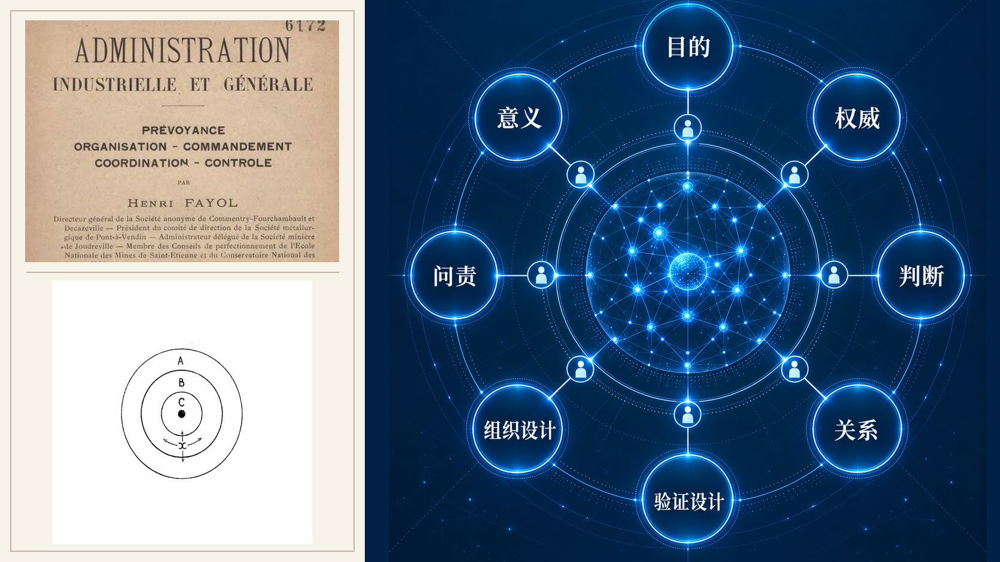

# 尾声　管理者的最后工作

这本书是从凌晨三点开始的。

一笔可疑的付款，被一队 agent 发现、调查、交叉验证，天亮时摆到了一个人的待办里。那个人喝着咖啡，花四分钟读完，做了一个决定，冻结，转法务。

现在走完了整本书，可以重新看那个场景，看清一件当时说不清的事。那一夜的活，绝大部分是 agent 干的，调查、比对、排除、取证，机器又快又不知疲倦地做完了。人做的，只有最后那一件事，一个决定。

但恰恰是那一件事，是整个链条里唯一不能被交出去的。不是因为 agent 干不了点一下冻结这个动作，它当然干得了。是因为那个动作背后连着的东西，agent 承担不起。如果冻错了，得罪了一个重要客户，谁来面对。如果没冻，放走了一笔欺诈，谁来担责。这个该不该冻的判断里，含着对业务的理解、对关系的权衡、对后果的承担，这些是人的。

这就是这本书想说的全部。agent 会接手越来越多的做，但有一些决定，永远该留在人手里。问题从来不是人还能干什么 agent 干不了的活，那条线每天都在移动，今天 agent 干不了的，明天可能就干了。真正的问题是另一个。

---

这本书用十六章，顶着一位又一位管理学大师，把这个问题一层层剥开。

第一部，回到管理的源头。泰勒教我们，管理最初是把方法从个人脑子里搬出来、变成组织的资产，而 agent 时代，要连工人一起设计。巴纳德教我们，组织是靠共同目的和沟通维系的协作系统，而 agent 组织里，得把合法的拒绝工程化。麦格雷戈教我们，对人的假设会变成现实，而对人要用 Y 理论，对 agent 要用校准的授权，两把尺子不能混。德鲁克教我们，看贡献不看忙碌，而 agent 让忙碌变得几乎免费，得学会给组织的注意力做预算。

第二部，认识那个新执行者。它不是一种东西，是一个正在分化的物种谱系，个人管家、员工队伍、应用副驾、流程专才。西蒙的有限理性告诉我们，管它之前先得给它做形态定位。明茨伯格的十角色告诉我们，管理幅度不再是带几个人，是能安全监督几条回路。我们看着岗位让位给结果单元，看着 SOP 进化成人机共用的能力模块。

第三部，是全书的核心。法约尔那张用了一百年的管理职能表，计划、组织、指挥、协调、控制，被改写成了一套面向混合组织的新循环，计划、组织、授权、运行、验证、进化。一个字的替换，指挥变授权，藏着整个时代的断裂。我们学会了把自治当成一道可收放的阶梯，把组织分成宪法层和流动层，把绩效从看 KPI 逼进到看证据链，把学习分成能放手的单环和要审批的双环，最后守住那条最沉的底线，权威可以自动化，问责不能无主。

第四部，望向远处。AI Native 不是无人企业，是把人挪到高杠杆的判断点，马奇在这里。公司的边界正在从一道墙，变成一层可以调节通透性的膜，科斯在这里。

一条线，贯穿了这十六章，从头到尾没变过。它是这本书反复砸的那颗钉子，agent 让构建和执行变便宜，却让验证、判断、治理变得更贵，不是更便宜。八个战场、无数案例，全都指向它。生成一份报告几乎免费，但读它、验它、信它、为它负责，越来越贵。这不是一个技术判断，是一个管理判断，当做变得廉价，稀缺的就成了判断该信什么、该做什么、该由谁负责。

---

顺着这条钉子推到底，就推到了这本书真正的落点。它不是一个乐观的问题，也不是一个悲观的问题，是一个定位的问题。当机器执行了大部分的构建和执行，哪些决定、哪些关系、哪些后果，必须永远归属于人。

别把这个人的残余，定义成当前 agent 还做不了的任务。那是一条会移动的线，你今天守在那里，明天就被冲垮。真正的人的残余，是一些不因 agent 变强而缩小的东西。

- 目的。选择什么值得做，判断哪些权衡是正当的。机器能优化任何给定的目标，但该追求哪个目标，是人的。
- 权威。授予、约束、和收回被委派的权力。机器可以行使权威，但谁该有多大权，是人定的。
- 判断。在规则、数据、先例互相冲突的例外时刻，做出裁断。机器擅长规则内的事，但规则没覆盖到的地方怎么办，是人的。
- 关系。信任、关怀、说服、团结，那些不能被简化成任务完成的东西。
- 验证设计。决定什么样的证据算数、谁来查谁。
- 组织设计。定义角色、边界、激励，跨越人和 agent。
- 问责。承担法律的、政治的、财务的、道德的后果。这一条，是 Air Canada 那个判例用法律的方式钉死的，责任不会因为是 AI 干的就蒸发。
- 意义。决定这份工作，对这家机构、对它服务的人，到底意味着什么。

这八样，就是管理者的最后工作。它们不是 agent 暂时做不到的事，是就算 agent 无所不能，也不该交出去的事。因为交出这些，交出的不是效率，是人对自己所造之物的责任本身。

---

New Lab 那批公司给了我们一个提醒。别去抄它们的神话，十个人融十亿美元、明星团队、去掉管理层，大多数组织抄不了，也不该抄。要抄的是它们的机制，缩短协调的距离，给多学科的小队真正的结果所有权，把有界的活自动化掉，让评估持续进行，建立一套在创始人、模型、市场都会变的世界里依然可信的治理。

这本书从头到尾，也是这个立场，不吹，也不唱衰。它用最真实的案例，包括那些翻车的、被高估的、被法院判赔的，是因为管理从来就是一门在不完美的现实里把事情做成的手艺。一本只讲光明的 AI 管理书，读者读完什么也用不上。

所以最后，留一个开放的问题，不给标准答案。这本书讲的是从管人，到管人加 Agent。但你有没有想过，当 agent 强到能自己提出目标、能重写流程、能设计出下一代比自己更强的 agent，那时候的管理者，还是在管理一群执行者吗。还是在做一件更古老、也更根本的事，培育一种新的智能，并对它将会成为什么，负起责任。

凌晨三点，那队 agent 还在不知疲倦地跑着。天亮时，总得有一个人，喝着咖啡，做那个决定。这本书，是写给那个做决定的人的。

（全书完）

## 尾声插图

